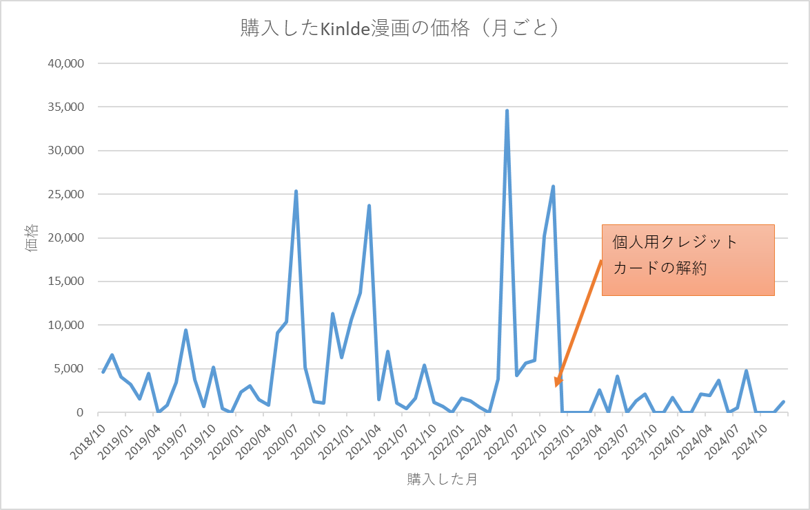
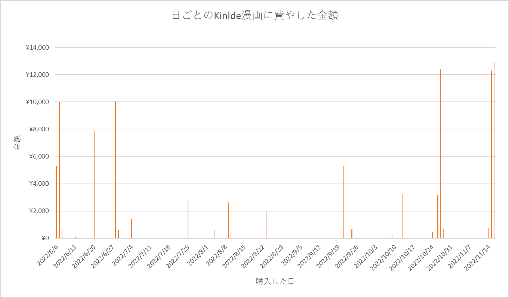

% Kindle漫画の買い過ぎを防ぐため個人用クレジットカードを解約しました
% yuji38kwmt
% 2024-01-18

# 自己紹介
* 妻、子供2人（3歳, 1歳）の4人家族
* 漫画を読むのが好き
    * 2018年10月から物理本の購入をやめてKindle本を購入するようになった
* 所持していたクレジットカード
    * 個人用：引き落とし口座は私自身の口座。購入物を妻に伝える必要なし。2022年11月に解約。
    * 家族用：引き落とし口座は家族用の口座。購入物を妻に伝える必要あり。

::: notes

自己紹介です。妻と子供2人の4人家族です。
漫画を読むのが好きです。
2018年10月から物理本の購入をやめてKindle本を購入するようになりました。
クレジットカードは個人用と家族用の2つを所持していました。個人用は購入した物を妻に伝える必要はありません。2022年11月に解約しました。

:::

---

# Kindle漫画に費やした金額
    
---

# 年ごとのKindle漫画に費やした金額

| 年 | 金額 | 個数 |
|----------|-------------:|---------------:|
| 2018年   | ¥15,318     | 22            |
| 2019年   | ¥32,893     | 57            |
| 2020年   | ¥77,584     | 128           |
| 2021年   | ¥66,827     | 116           |
| 2022年   | ¥104,064    | 161           |
| 2023年   | ¥11,780     | 18            |
| 2024年   | ¥14,297     | 22            |
| 合計     | ¥322,763    | 524           |

::: notes

この表は、年ごとのKindle漫画に費やした金額です。
2022年は10万円以上費やしました。最もKindle漫画に費やした年でした。

:::

---

# 集計方法
* 集計期間：2018年10月～2024年12月
* 購入時の漫画の価格から金額を算出。実際に支払った金額ではない。
    * ポイントによる割引は考慮していない
* 技術書、小説、実用書は含めていない
    * 私にとって娯楽である漫画が集計対象
    * 小説は私にとって娯楽ではなく勉強に近い感覚
* Kindle Unlimitedは1冊の漫画とみなす

::: notes

集計方法です。
集計期間は2018年10月から2024年12月です。
購入時の漫画の価格から金額を算出しました。実際に支払った金額ではありません。たとえばポイント割引は考慮していません。
私にとって娯楽である漫画が集計対象です。技術書、小説、実用書などは私にとって娯楽ではなく勉強に近い感覚なので、除外しました。

:::

---

# 月ごとのKindle漫画に費やした金額

::: notes

月ごとのKindle漫画に費やした金額を折れ線グラフにしました。
1か月に2万円以上費やした月が数回ありました。

:::

---

# 2万円以上費やした月 

| 月      | 金額    | 個数 |
|---------|---------:|------:|
| 2020/07 | 25,370  | 38   |
| 2021/03 | 23,711  | 42   |
| 2022/06 | 34,625  | 53   |
| 2022/10 | 20,277  | 35   |
| 2022/11 | 25,936  | 37   |

::: notes

1か月に2万円以上費やした月の具体的な金額と漫画の個数です。
2022年6月から2022年11月に絞って、日ごとに確認してみましょう。

:::

---

# 日ごとのKindle漫画に費やした金額

::: notes

毎日漫画を買っているのではなく、ある日に1万円以上費やして、結果1か月に2万円以上漫画に費やしていました。
では、1万円以上費やす日に、私はどのように行動しているのでしょうか？

:::

---

# 数冊以上の漫画を購入した日の行動

漫画の続きが気になって衝動的に購入していた

1. 1巻が無料の漫画を読む
2. 続きが気にになって、2巻を購入して読む
4. 続きが気にになって、3巻を購入して読む
4. ...
5. タイムリミットが来たら読むのを止める

::: notes

まず、1巻が無料の漫画を読みます。
そして続きが気になり、2巻を購入して読みます。
さらに続きが気になり、3巻を購入して読みます。
これを繰り返して、タイムリミットが来たら読むをやめます。

つまり、漫画の続きが気になって衝動的に購入していました。
:::

-----

# 衝動的に漫画を購入した後

* 買った漫画は1回しか読まない
* 一気に読んだだめ、漫画の内容が思い出せない
* 「なぜこの漫画を買ってしまったのだろうか。もっと他に買いたい漫画があったのに…」と後悔する

::: notes

衝動的に漫画を購入してまうと、どうなるのでしょうか？

まず買った漫画は1回しか読みません。また一気に読むため内容も思い出せません。
そして、「なぜこの漫画を買ってしまったのだろうか。もっと他に買いたい漫画があったのに」と後悔します。

:::

-----

# 漫画の衝動買いを改善する

-----

# 改善する目的
* 「なぜ買ってしまったのか」と後悔しないようにするため
    * 後悔を続けるとメンタル的に良くない（気がする）
* 漫画に費やす金額を減らすことが目的ではない
    * 本当に欲しいものなのならば、許容できる金額

::: notes

漫画の衝動買いを改善しようとしました。
改善する目的は、「なぜ買ってしまったのか」と後悔しないようにするためです。後悔を続けるとメンタル的に良くない気がします。
漫画に費やす金額を減らすことが目的ではありません。本当に欲しいものなのならば、私にとっては許容できる金額です。

:::

----

# 試したこと1：スマートフォンのKindleアプリをアンインストール
スマートフォンで漫画を読むことが多いので、Kindleアプリをアンインストールした。

### 結果
* すぐにインストールしてしまい、効果はなかった
* 漫画の続きが気になっているとき、「アプリのインストール」は購入を止めるハードルにならなかった

::: notes

1つ目に試したことです。スマートフォンで漫画を読むことが多いので、Kindleアプリをアンインストールしました。
しかし、すぐにインストールしてしまい、効果はありませんでした。
漫画の続きが気になっているとき、「アプリのインストール」は購入を止めるハードルになりませんでした。

:::

----

# 試したこと2：Amazonアカウントのパスワード変更
パスワードを変えてパスワードをスマートフォンに保存しなければ、一時的にKindleで漫画が読めなくなるので、パスワードを変更した。

### 結果
* すぐにパスワードを再設定してしまい、効果はなかった
* 漫画の続きが気になっているとき、「パスワードの再設定」は購入を止めるハードルにならなかった

::: notes

2つ目に試したことです。Amazonアカウントパスワードを変えてパスワードをスマートフォンに保存しなければ、一時的にKindleで漫画が読めなくなるので、Amazonアカウントのパスワードを変更しました。
しかし、すぐにパスワードを再設定してしまい、効果はありませんでした。
漫画の続きが気になっているとき、「パスワードの再設定」は購入を止めるハードルになりませんでした。

:::

----

# 試したこと3：個人用クレジットカードの解約
アプリのアンインストールもパスワードの変更も、数分あれば元通りになる。
すぐに元通りにならない施策として、個人用クレジットカードを解約した。

### 結果
* 効果があった（後述参照）
* 個人用クレジットカード解約後は、漫画に費やした毎月の金額は5千円以下に収まっていた

::: notes

3つ目に試したことです。すぐに元通りにならない施策として、個人用クレジットカードを解約しました。
これは効果がありました。個人用クレジットカード解約後は、漫画に費やした毎月の金額は5千円以下に収まっていました。

:::

----

# 月ごとのKindle漫画に費やした金額（再掲）

::: notes

再び、月ごとのKindle漫画に費やした金額の折れ線グラフを表示します。
2022年11月末に個人用クレジットカードを解約しました。
解約後は解約前と比較すると、漫画に費やす金額が小さくなったことが分かります。

:::

----

# 個人用クレジットカードを解約したあとの生活

----

# 個人用に欲しいものを買うとき
* 物理店舗では現金で購入する
* AmazonやGoogle Playでの買い物は、コンビニでギフトカードを必要な分だけ購入する
* ギフトカードが使えないWebサービス（Adobeライセンスなど）での買い物は、妻に許諾を得て家族用クレジットカードで購入する。そのあと、家族用の口座に現金を入金する。

家族用クレジットカードは利用できるので、生活に支障は出なかった。

::: notes

個人用クレジットカードを解約したあとの、個人用に欲しいものを買うときは次なやり方になりました。
物理店舗では現金で購入します。
AmazonやGoogle Playでの買い物は、コンビニでギフトカードを必要な分だけ購入します。
ギフトカードが使えないWebサービスでの買い物は、妻に許諾を得て家族用クレジットカードで購入します。そのあと、家族用の口座に現金を入金します。

家族用クレジットカードは利用できるので、生活に支障は出ませんでした。

:::

----

# 漫画の続きが気になったときの行動

1. 漫画の続きが気になる
2. ギフトカードの残高がないため、購入できない
3. 諦める
4. 次の日、漫画の続きが気にならなくなる
    
次の日にギフトカードを買ってでも購入したい漫画は、きっと本当に欲しい漫画なので、後悔しないだろう。

::: notes

個人用クレジットカードを解約したあとは、漫画の続きが気になってもギフトカードの残高がないため購入できません。
なので、強制的に諦めることができます。
次の日は、意外にも漫画の続きは気にならなくなります。
もし次の日にギフトカードを買ってでも購入したい漫画は、きっと本当に欲しい漫画なので、後悔しないでしょう。このような買い物は許容することにします。

:::

----

# 気持ち
* 精神的に楽になった
    * 「本当は買わない方がよいけど、続きが気になるから買いたい」という葛藤がなくなった
    * 「衝動買いしてしまった」という後悔がなくなった
* 解約した直後は「みんなが当たり前に使っているクレジットカードを私はコントロールできない」という劣等感を感じた
    * 対策：「私はクレジットカードをコントロールできない意志が弱い人間です」と開き直った
    * 対策：「私に衝動買いさせるのは、漫画が魅力的だから」と他責で考えた
    

::: notes

個人用クレジットカードを解約したあとの気持ちですが、精神的に楽になりました。
「本当は買わない方がよいけど、続きが気になるから買いたい」という葛藤がなくなり、「衝動買いしてしまった」という後悔がなくなったためだと思います。
ただし、解約した直後は「みんなが当たり前に使っているクレジットカードを、なぜ私はコントロールできないのだろうか」という劣等感を感じました。
この劣等感に対しては、次のように考えるようにして対策しました。
1つ目は「私はクレジットカードをコントロールできない意志が弱い人間です」と開き直るようにしました。
2つ目は「私に衝動買いさせるのは、漫画が魅力的だからだ。この魅力に私は抗うことができない。」と他責で考えるようにしました。

:::

    
----

# 衝動買いを防ぐごとができた要因

* ギフトカードを必要な分しか購入していない
    * 常に1万円分の残高がある状態だと、防げなかっただろう
* 最寄りのコンビニまで徒歩20分かかる
    * 徒歩5分圏内にコンビニがあったら、夜中にこっそりコンビニに行ってギフトカードを買っていたかもしれない
* 家族用クレジットカードがあるため、生活に支障が出ない
    * 独身だった場合、クレジットカードを解約すると生活に支障が出て、再契約したかもしれない

::: notes

個人用クレジットカードを解約することで、なぜ私は衝動買いを防ぐことができたのでしょうか？
その要因を考えてみました。

1つ目は、ギフトカードを必要な分しか購入していないことです。たとえば常に1万円分の残高がある状態だと、衝動買いは防げなかったと思います。
2つ目は、コンビニが我が家の近くになかったことです。徒歩5分圏内にコンビニがあったら、夜中にこっそりコンビニに行ってギフトカードを買っていたかもしれません。
3つ目は、家族用クレジットカードがあるため、生活に支障が出なかったことです。独身だった場合、クレジットカードを解約すると生活に支障が出て、クレジットカードを再契約したかもしれません。

:::

----
# まとめ

* 個人用クレジットカードを解約して、Kindle漫画の買い過ぎを防ぐことができた

::: notes

まとめです。
個人用クレジットカードを解約したことで、Kindle漫画の買い過ぎを防ぐことができました。

:::

----

# 補足

----

# データをGitHubに置いた

----

# 元通りになるきっかけ

以下のようなことが起きたら、私はきっと元の状態戻るでしょう。

* Amazonのギフトカードがコンビニからなくなる
* 自宅の近くにコンビニができる
* 「以前よりも意志が強くなったから、クレジットカードを適切に使えると思う」という自身が生まれ、くれっじとカードを再契約する

----

# 没施策
思いついたけど試さなかったこと

* Amazonアカウントの削除
    * Amazonアカウントがなくなれば、もう漫画を購入することはないだろうと考えた
    * 過去に購入した漫画が一切読めなくなるのはつらいので、やめた
* インターネット回線の解約
    * インターネットが使えないと仕事ができない
* スマートフォンの廃棄
    * スマートフォンありきの世界なので、現代社会を生きられない。。。

----

# 私は依存症？

### 依存症の定義

> 人が「依存」する対象は様々ですが、代表的なものに、アルコール・薬物・ギャンブル等があります。
> このような特定の物質や行為・過程に対して、やめたくても、やめられない**ほどほど**にできない状態をいわゆる依存症といいます。

https://www.mhlw.go.jp/stf/seisakunitsuite/bunya/0000149274.html

### 依存症の解決方法
「止め続ける」。
アルコール依存症の場合は、少量にするのでなく断酒すること。

### 依存症の解決方法
私を「漫画依存症」だと仮定すると、本当は漫画断ちしなくてはいけない。
でも、漫画を断つには、インターネット回線を解約したり、スマートフォンを持たない生活にする必要がある。
現代社会でこれできる？

